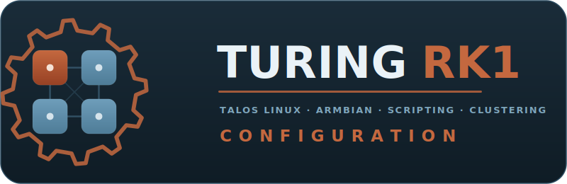

# Turing RK1 Kubernetes Cluster



[](https://github.com/freed-dev-llc/turing-rk1-cluster/releases)
[](https://github.com/freed-dev-llc/turing-rk1-cluster/actions/workflows/lint.yml)
[](https://github.com/freed-dev-llc/turing-rk1-cluster/actions/workflows/codeql.yml)
[](https://opensource.org/licenses/Apache-2.0)
[](https://www.talos.dev/)
[](https://k3s.io/)
[](https://kubernetes.io/)

> **Part of the Turing Pi cluster stack:** the **provider** drives the Turing Pi BMC, the **modules** wrap it into reusable Terraform, and the cluster repos deploy Kubernetes on top — **Talos** (this repo) or **K3s**.

[](https://github.com/freed-dev-llc/terraform-provider-turingpi)
[](https://github.com/freed-dev-llc/terraform-turingpi-modules)
[](https://github.com/freed-dev-llc/turing-ansible-cluster)

A 4-node bare-metal Kubernetes cluster built on Turing RK1 compute modules, supporting both **Talos Linux** and **K3s on Armbian** distributions. Designed for edge computing, AI/ML workloads with NPU acceleration, and distributed storage.

## Contents

- [Choose Your Distribution](#choose-your-distribution)
- [Documentation](#documentation)
- [Hardware](#hardware)
- [Software Stack](#software-stack)
- [Access & Networking](#access--networking)
- [Limitations & Known Issues](#limitations--known-issues)
- [Repository Structure](#repository-structure)
- [Security Notes](#security-notes)
- [Contributing](#contributing) · [License](#license)

---

## Choose Your Distribution

| Distribution | Best For | NPU/GPU | Shell Access |
|--------------|----------|---------|--------------|
| **[Talos Linux](docs/INSTALLATION.md)** | Production, Security | Partial | API only |
| **[K3s on Armbian](docs/INSTALLATION-K3S.md)** | Development, AI/ML | **Yes** | SSH |

See [docs/COMPARISON.md](docs/COMPARISON.md) for a detailed feature comparison.

### Quick Start

```bash
# Talos Linux (automated deployment)
./scripts/deploy-talos-cluster.sh prereq    # Check prerequisites
./scripts/deploy-talos-cluster.sh deploy    # Full deployment

# K3s on Armbian
./scripts/setup-k3s-node.sh   # Run on each node
./scripts/deploy-k3s-cluster.sh  # Deploy from workstation

# Check cluster status (works with both distributions)
./scripts/talos-cluster-status.sh           # Auto-detects and shows health summary
```

> **Note**: This project is under active development. See [CONTRIBUTING.md](CONTRIBUTING.md) for how to get involved.

---

## Documentation

### Primary Documentation

| Document | Path | Description |
|----------|------|-------------|
| Docs Index | [docs/README.md](docs/README.md) | Documentation overview |
| **Talos Installation** | [docs/INSTALLATION.md](docs/INSTALLATION.md) | Talos Linux setup guide |
| **K3s Installation** | [docs/INSTALLATION-K3S.md](docs/INSTALLATION-K3S.md) | K3s on Armbian setup guide |
| **Distribution Comparison** | [docs/COMPARISON.md](docs/COMPARISON.md) | Talos vs K3s feature matrix |
| Architecture Diagrams | [docs/ARCHITECTURE.md](docs/ARCHITECTURE.md) | Visual cluster architecture (Mermaid) |
| Storage Guide | [docs/STORAGE.md](docs/STORAGE.md) | Longhorn and NVMe configuration |
| Networking Guide | [docs/NETWORKING.md](docs/NETWORKING.md) | MetalLB and Ingress setup |
| Monitoring Guide | [docs/MONITORING.md](docs/MONITORING.md) | Prometheus, Grafana & external monitoring |
| Quick Reference | [docs/QUICKREF.md](docs/QUICKREF.md) | Command cheatsheet |

### Configuration Files

| File | Path | Description |
|------|------|-------------|
| Talos Config | [cluster-config/talosconfig](cluster-config/talosconfig) | Talos CLI configuration |
| Kubeconfig | [cluster-config/kubeconfig](cluster-config/kubeconfig) | Kubernetes access |
| Cluster Secrets | [cluster-config/secrets.yaml](cluster-config/secrets.yaml) | **Keep secure!** |
| MetalLB Config | [cluster-config/metallb-config.yaml](cluster-config/metallb-config.yaml) | IP pool configuration |
| Ingress Config | [cluster-config/ingress-config.yaml](cluster-config/ingress-config.yaml) | Ingress rules |
| Portainer Agent | [cluster-config/portainer-agent.yaml](cluster-config/portainer-agent.yaml) | Agent deployment |
| Prometheus Values | [cluster-config/prometheus-values.yaml](cluster-config/prometheus-values.yaml) | Monitoring stack config |
| External Scrape | [cluster-config/external-scrape-config.yaml](cluster-config/external-scrape-config.yaml) | Docker host monitoring |

### Reference Documentation

| Document | Path | Description |
|----------|------|-------------|
| Cluster Plan | [CLUSTER_PLAN.md](CLUSTER_PLAN.md) | Original deployment plan |
| Talos Schematic | [talos-schematic.yaml](talos-schematic.yaml) | Custom image configuration |

### External Resources

| Resource | URL |
|----------|-----|
| Talos Documentation | https://www.talos.dev/docs/ |
| K3s Documentation | https://docs.k3s.io/ |
| Longhorn Documentation | https://longhorn.io/docs/ |
| Turing Pi Documentation | https://docs.turingpi.com/ |
| MetalLB Documentation | https://metallb.io/ |
| NGINX Ingress | https://kubernetes.github.io/ingress-nginx/ |
| Prometheus Documentation | https://prometheus.io/docs/ |
| Grafana Documentation | https://grafana.com/docs/ |
| RKNN SDK (NPU) | https://github.com/airockchip/rknn-toolkit2 |
| RKLLM (LLM inference) | https://github.com/airockchip/rknn-llm |

---

## Hardware

### Specifications

| Component | Specification |
|-----------|---------------|
| Board | Turing Pi 2 (Mini-ITX) — 4x CM4/RK1 slots, integrated BMC |
| SoC (per node) | Rockchip RK3588 — 4x Cortex-A76 @ 2.4GHz + 4x Cortex-A55 @ 1.8GHz |
| RAM (per node) | 32GB LPDDR4X |
| GPU / NPU | Mali-G610 MP4 / 6 TOPS INT8 NPU — *see [Limitations](#limitations--known-issues)* |
| Storage (per node) | 32GB eMMC (system) + 500GB Crucial P3 NVMe |
| Network / Power (per node) | 1x 1Gbps Ethernet · ~10W draw |

### Topology & Totals

```
┌─────────────────────────────────────────────────────────────┐
│                    Turing Pi 2 BMC                          │
├─────────────┬─────────────┬─────────────┬───────────────────┤
│   Node 1    │   Node 2    │   Node 3    │      Node 4       │
│ Control Pl. │   Worker    │   Worker    │      Worker       │
│ 32GB · 500GB│ 32GB · 500GB│ 32GB · 500GB│  32GB · 500GB     │
└─────────────┴─────────────┴─────────────┴───────────────────┘
```

**Totals:** 32 CPU cores · 128GB RAM · 128GB eMMC · 2TB NVMe (4x 500GB) · 4x 1Gbps.
The control plane is schedulable, so all 4 nodes run workloads and contribute NVMe to Longhorn.
Suited to container orchestration, distributed storage, and CPU/NPU inference (~12 GFLOPS/node
for matrix ops; full NPU acceleration on the K3s path). Node IPs are in
[Access & Networking](#access--networking).

---

## Software Stack

> Components track the latest stable release unless a version is pinned below.

| Layer | Components |
|-------|-----------|
| OS | Talos Linux **v1.13.5** (immutable, API-driven) · Linux kernel **6.18.36** (ARM64) |
| Kubernetes | Kubernetes **v1.35.0** · containerd **v2.1.5** · etcd (bundled) |
| Networking | Flannel CNI (bundled) · MetalLB (L2 LoadBalancer) · NGINX Ingress |
| Storage | Longhorn — distributed block storage + CSI provisioning |
| Monitoring | Prometheus · Grafana · Alertmanager · node-exporter · kube-state-metrics |
| Management | talosctl **v1.13.5** · kubectl **v1.35.x** · Helm **v3.x** · Portainer Agent **v2.33.6** |

---

## Access & Networking

### IP Allocation

| Resource | IP Address | Port(s) |
|----------|------------|---------|
| BMC | 10.10.88.70 | 22 (SSH) |
| Control Plane | 10.10.88.73 | 6443 (API) |
| Worker 1 | 10.10.88.74 | - |
| Worker 2 | 10.10.88.75 | - |
| Worker 3 | 10.10.88.76 | - |
| Ingress Controller | 10.10.88.80 | 80, 443 |
| Portainer Agent | 10.10.88.81 | 9001 |
| Available Pool | 10.10.88.82-89 | - |

### Internal Networks

| Network | CIDR | Purpose |
|---------|------|---------|
| Pod Network | 10.244.0.0/16 | Container IPs |
| Service Network | 10.96.0.0/12 | ClusterIP services |

### Management URLs

| Service | URL | Notes |
|---------|-----|-------|
| Kubernetes API | https://10.10.88.73:6443 | Use kubeconfig |
| Grafana | http://grafana.local | Default: admin/admin |
| Prometheus | http://prometheus.local | Metrics & queries |
| Alertmanager | http://alertmanager.local | Alert management |
| Longhorn UI | http://longhorn.local | Storage management |
| Portainer | Your Portainer instance | Connect agent: `10.10.88.81:9001` |

Add to `/etc/hosts`:
```
10.10.88.80  grafana.local prometheus.local alertmanager.local longhorn.local
```

### CLI Access

```bash
# Set environment variables
export TALOSCONFIG=/path/to/cluster-config/talosconfig
export KUBECONFIG=/path/to/cluster-config/kubeconfig

# Verify cluster
kubectl get nodes
talosctl health
```

### BMC Setup

The deployment scripts require access to the Turing Pi BMC. Configure credentials by copying the example file:

```bash
cp .env.example .env
# Edit .env with your BMC credentials
```

Required variables in `.env`:

| Variable | Description | Default |
|----------|-------------|---------|
| `TPI_HOSTNAME` | BMC IP address | `10.10.88.70` |
| `TPI_USERNAME` | BMC login username | - |
| `TPI_PASSWORD` | BMC login password | - |
| `USE_LOCAL_TPI` | Use local tpi CLI (1) or SSH to BMC (0) | `1` |

Test BMC connectivity:

```bash
./scripts/wipe-cluster.sh status
```

---

## Limitations & Known Issues

### NPU: Partial on Talos, Full on K3s

| Capability | Status | Details |
|-------|--------|---------|
| RK3588 NPU driver | **Talos: Partial** | The mainline open-source `rocket` driver loads via the contrib `siderolabs/rockchip-rknn` extension (Talos 1.13 / Linux 6.18), exposing `/dev/accel/accel0` |
| RKNN SDK / RKLLM | **Talos: Not supported** | `librknnrt` / `rknn-toolkit2` / RKLLM require Rockchip's proprietary `rknpu` BSP driver, which is *not* the mainline `rocket` driver |
| Either NPU stack | **K3s/Armbian: Supported** | BSP kernel + RKNN SDK provide full NPU support, including LLMs |

**Impact:** On Talos the NPU driver is now available, but only the open Mesa **Teflon** (TFLite) path works - limited to MobileNet-class CNNs, effectively single-core, and **no LLM (RKLLM) support**. The full RKNN/RKLLM stack this repo vendors (`repo/rknn-llm`, `repo/rknn-toolkit2`) runs on the **K3s/Armbian** path only.

**Solutions:**
1. **Run RKNN/RKLLM workloads on K3s on Armbian** - full NPU support with the RKNN SDK (see [docs/INSTALLATION-K3S.md](docs/INSTALLATION-K3S.md))
2. **On Talos**, use the open `rocket`/Teflon path for small CNNs, or CPU-based inference (ONNX Runtime, TensorFlow Lite)

> **Verified on real RK1 hardware (2026-06-23):** the `rocket` driver binds (kernel module Live) and `/dev/accel/accel0` is present on all 4 nodes running Talos v1.13.5 + the `rockchip-rknn` extension. Check with `talosctl get modules` / `talosctl list /dev/accel/`.

### GPU: Partial on Talos, Full on K3s

| Capability | Status | Details |
|-------|--------|---------|
| Mali-G610 GPU driver | **Talos: Partial** | The `panthor` driver loads via the contrib `siderolabs/panfrost` extension (OpenGL ES / Vulkan); no proprietary Mali blob, limited OpenCL, no device plugin |
| | **K3s/Armbian: Supported** | BSP userspace provides OpenCL and Vulkan |

**Impact:** On Talos the open `panthor` driver enables OpenGL ES/Vulkan, but not the proprietary OpenCL stack. K3s on Armbian provides full GPU support.

> **Note:** the RK3588 GPU and NPU are integrated SoC blocks - PCIe/VFIO "passthrough" does not apply. The model is a host-kernel driver plus exposing `/dev/dri/renderD128` (GPU) or `/dev/accel/accel0` (NPU) into a container (CDI is enabled by default in Talos 1.13).

### Storage Limitations

| Issue | Status | Details |
|-------|--------|---------|
| All 4 nodes have a 500GB NVMe | Info | The control plane is schedulable (`allowSchedulingOnControlPlanes`) and its NVMe is used for Longhorn, like the workers |
| Single replica risk | Configurable | Default 3 replicas; 2-replica mode loses redundancy if node fails |

### Network Limitations

| Issue | Status | Details |
|-------|--------|---------|
| No native LoadBalancer | Mitigated | MetalLB provides L2 LoadBalancer functionality |
| Single network interface | Hardware | Each node has only 1x 1Gbps NIC |

### Talos-Specific Considerations

| Issue | Details |
|-------|---------|
| Immutable filesystem | Cannot install packages; must use extensions or containers |
| No SSH access | Nodes managed via `talosctl` API only |
| Privileged namespaces | Many add-ons require `pod-security.kubernetes.io/enforce=privileged` label |

### Known Bugs

| Issue | Status | Workaround |
|-------|--------|------------|
| PodSecurity warnings on deploy | Expected | Label namespaces as privileged |
| MetalLB speaker pods require privileges | Expected | Namespace is pre-labeled |

---

## Repository Structure

```
turing-rk1-cluster/
├── README.md                 # This file
├── CLUSTER_PLAN.md           # Deployment planning document
├── .env.example              # Environment variables template
├── talos-schematic.yaml      # Talos image customization
├── cluster-config/           # Cluster configurations
│   ├── talosconfig           # Talos CLI config
│   ├── kubeconfig            # Kubernetes access
│   ├── secrets.yaml          # Cluster secrets (sensitive!)
│   ├── controlplane.example.yaml # Sanitized CP template (real controlplane.yaml is generated + gitignored)
│   ├── worker.example.yaml   # Sanitized worker template (real worker.yaml is generated + gitignored)
│   ├── metallb-config.yaml   # MetalLB IP pool
│   ├── ingress-config.yaml   # Ingress rules
│   ├── prometheus-values.yaml # Monitoring stack config
│   ├── external-scrape-config.yaml # External targets
│   └── *.yaml                # Other configurations
├── scripts/                  # Automation scripts
│   ├── deploy-talos-cluster.sh # Automated Talos deployment
│   ├── talos-cluster-status.sh # Cluster health and status checker
│   ├── setup-k3s-node.sh     # Armbian node preparation
│   ├── deploy-k3s-cluster.sh # K3s cluster deployment
│   └── wipe-cluster.sh       # Cluster reset/migration tool
├── docs/                     # Documentation
│   ├── README.md             # Docs index
│   ├── INSTALLATION.md       # Talos setup guide
│   ├── INSTALLATION-K3S.md   # K3s on Armbian setup guide
│   ├── COMPARISON.md         # Talos vs K3s comparison
│   ├── ARCHITECTURE.md       # Cluster architecture diagrams
│   ├── STORAGE.md            # Storage guide
│   ├── NETWORKING.md         # Network guide
│   ├── MONITORING.md         # Monitoring guide
│   └── QUICKREF.md           # Quick reference
├── images/                   # Talos images
│   └── latest/
│       └── metal-arm64.raw   # Current Talos image
└── repo/                     # Submodules/repos
    ├── sbc-rockchip/         # Talos Rockchip overlay
    ├── u-boot-rockchip/      # U-Boot for Rockchip (Talos image build)
    ├── rknn-toolkit2/        # RKNN SDK v2.3.2 (for K3s)
    ├── rknn-llm/             # RKLLM v1.2.3 (for K3s)
    └── rknn_model_zoo/       # Pre-built models (for K3s)
```

---

## Security Notes

1. **Secrets Protection**: `cluster-config/secrets.yaml` contains cluster credentials. Keep it secure and never commit to public repositories.

2. **BMC Access**: The BMC (10.10.88.70) has full control over all nodes. Restrict network access appropriately.

3. **Privileged Workloads**: Many add-ons require privileged namespace labels. Review security implications before deploying untrusted workloads.

4. **Network Segmentation**: Consider isolating the cluster network (10.10.88.x) from untrusted networks.

---

## Contributing

This is a personal homelab cluster. Configuration files and documentation are provided as-is for reference.

## License

Configuration files and documentation are provided under the Apache 2.0 license (see [LICENSE](LICENSE)). Third-party components retain their original licenses.
